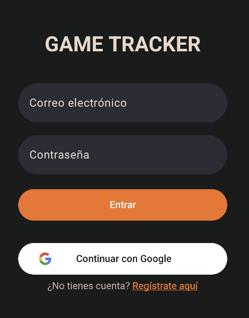
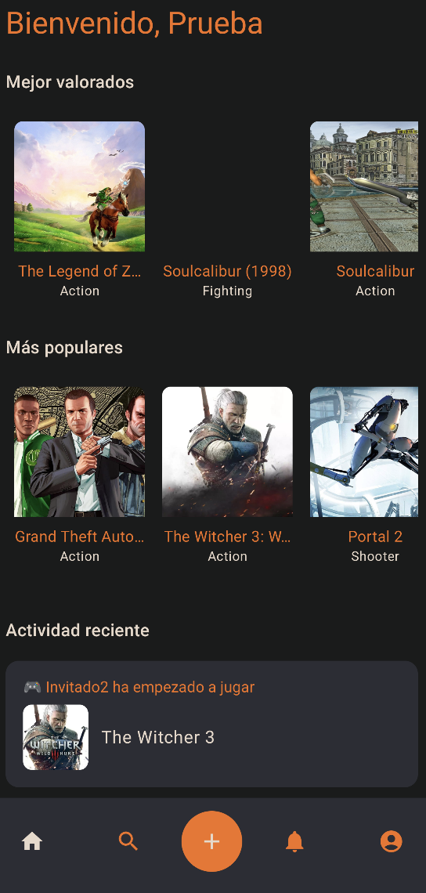
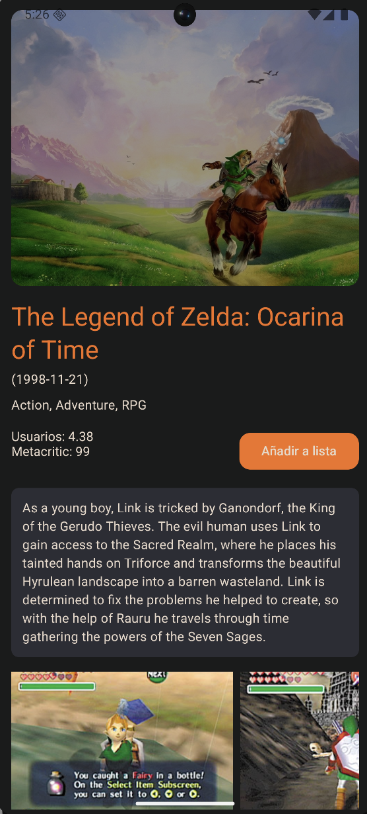
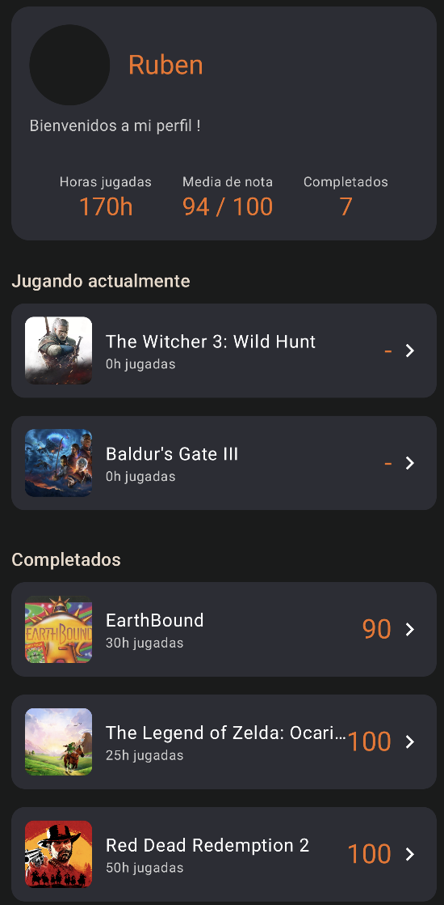

# SaveSlot
A backend application for gamers who want to track their game library and their completion progress in a simple and minimalistic way.

## Table of contents
- General info
- Architecture
- Setup
- Features
- Technologies
- Status

## General info
SaveSlot is a personal project inspired by Letterboxd and Backloggd. Users can track their game library with statuses, ratings, reviews and completion percentages.

## Architecture
SaveSlot follows a **monolith-first** approach - keeping the architecture simple until the complexity grows and it really needs it.

This project is organized **by features** (user, usergame, game) instead of technical layers. This distribution makes the codebase much easier to navigate and more scalable over time.

Each feature contains its own components following a layered structure:
- **Controller** - handles HTTP requests
- **Service** - contains and defines business logic
- **Repository** - manages data access
- **DTOs and Mappers** - handle data transfer and mapping

## Setup

### Prerequisites
- Java 21
- Docker

### Run locally
1. Clone the repository
2. Create an `.env` file based on `.env.example`
3. Start the database: `docker compose up -d`
4. Run Flyway migrations: `export $(cat .env | xargs) && ./mvnw flyway:migrate`
5. Start the app: `export $(cat .env | xargs) && ./mvnw spring-boot:run`

### Production API
Base URL: `https://save-slot-production.up.railway.app`

## Key features
- User authentication (sign up / log in)
- Search and explore games (powered by RAWG API)
- Personal play log with status (Playing, Completed, Dropped, Wishlist)
- Completion levels: Story, 100%, Platinum
- Rating and reviews

### Planned features 
- Customizable lists
- Follow other users and see their activity
- Achievements and badges for milestones (first platinum, completed a full saga, etc.)

## Mobile MVP (Prototype)
Before starting this Java/Spring backend project, I built a **mobile MVP using Kotlin and 
Jetpack Compose**.
The application includes the core features mentioned above.

This project is an evolution of that prototype, focused on what I enjoy the most: 
**backend development**.

## Screenshots from the mobile prototype

### Login

### Home Screen

### Game Information

### User list example

## Technologies
- **Language:** Java 21
- **Framework:** Spring Boot, Spring Security
- **Database:** PostgreSQL
- **ORM:** Spring Data JPA
- **Migrations:** Flyway
- **Containerization:** Docker
- **External API:** RAWG
- **CI/CD:** GitHub Actions
- **Documentation:** Swagger / OpenAPI

## Status
This project is in early development.

- [x] Define project scope and README structure
- [x] Define MVP features
- [x] Choose architecture and core technologies
- [x] Design domain entities
- [x] Set up Spring Boot project base
- [x] Implement user authentication (JWT)
- [x] Implement game search via RAWG API
- [x] Implement user game list with statuses
- [x] Implement completion levels
- [x] Deploy to Railway/Render
